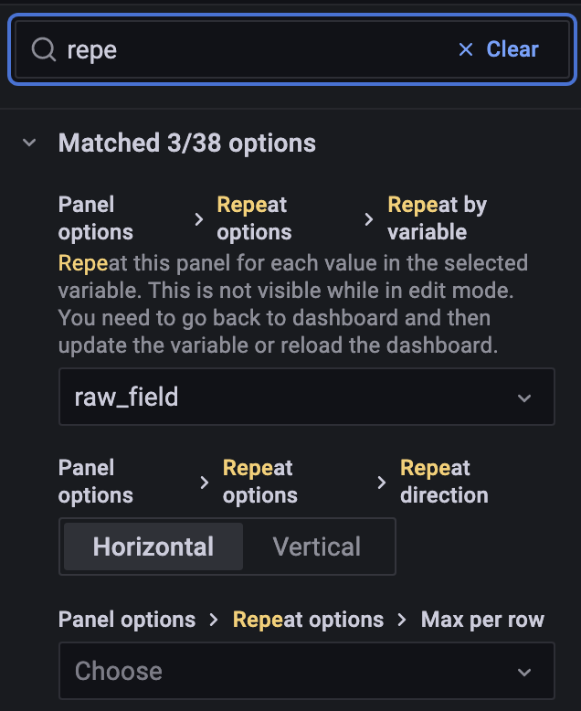

1. Afficher votre premier graph
  

Si vous manquez d'inspiration ou si vous ne savez pas comment représenter de la donnée la page [play.grafana.org](https://play.grafana.org/) contient plein d'exemple. Vous pouvez inspecter les paramètres et les modifier pour faire des tests
 
 
 

2. Variables
    Pour éviter de devoir créer un graphe identique pour plusieurs élément d'une liste, Grafana propose des variables.
    Dans notre cas ca peut être utile pour chaque état de la vache ou pour chaque paramètre 'raw'.
    Ces variables permettent à l'utilisateur de customiser son dashboard.  
    Pour créer ou modifier une variable ça se passe sur l'onglet 'variable' dans 'Dashboard Settings'  

    Vous pouvez utiliser ces variables dans vos requêtes
    [doc](https://grafana.com/docs/grafana/latest/variables/syntax/)
    [format option](https://grafana.com/docs/grafana/latest/variables/advanced-variable-format-options/)  

    Pour filtrer par cow id: 

    ```flux
    filter(fn: (r) => r["cow_id"] == ${cow_id:doublequote})
    ```

    1. Query Variables
        Vous pouvez créer des variables de façon dynamique a l'aide de requêtes externe.
        Ca peut être utile pour recupérer tous les cow_id ou event_id.
        Example pour donner la possibilité de choisir parmi les variables raw sur un graph:  
        

    2. Query dependencies
        Vous pouvez aussi utiliser vos variables pour faire de nouvelles requêtes
        ex: chercher tous les event_id en utilisant le cow_id déja sélectionné  

        

    3. Repeat by variable
        Maintenant que vous avez votre liste d'objet vous allez pouvoir indiquer a Grafana de créer un graph pour chaque élément de votre liste
        
        Dans la page d'edition de votre graph vous avez plusieurs option pour la répétition:
          

        Vous pouvez aussi utiliser une liste pour cloner une 'row'

3. Annotation
    En cliquant sur un point de vos graphique vous pouvez rajoutez une annotation,
    ca peut servir a donner du contexte ou signaler un événement notable.  

    1. Query Annotation

        Comme pour les variables vous pouvez indiquer â Grafana d'aller chercher dynamiquement de la donnée pour créer une annotation.
        Ça se passe au même endroit que pour les variables.

        Vous pouvez donner une période pour l'annotation (-12h pour heatlive_allaitant_prod_ia)
        

        Ces annotations s'appliqueront sur tous les graphiques de votre dashboard
        

4. Idées pour la suite
  
  
  
  
  

