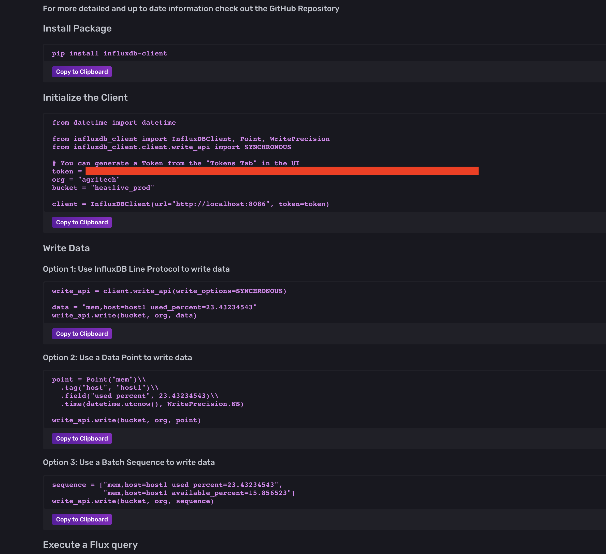

# Installation

Installer Influxdb avec brew

```bash
brew install influxdb
```

Lancer influxdb en tant que service

```bash
brew services start influxdb
```

---
Pour se connecter a la base données dans votre navigateur l'adresse par défaut est localhost:8086
Lors de votre première connexion il faudra peut être se connecter en tant que `admin:admin`

---
## Importer les données dans influxdb

La documentation détaillé du client python se trouve sur:
[github](https://github.com/influxdata/influxdb-client-python)

Vous pouvez trouvez toute les informations nécessaire a la connexion a influxdb
via python se trouve sur votre page d'administration influxdb ici:




---
1. Créer votre fichier d'initialisation

   Ce fichier servira lors de la connexion a influxdb,
   il permet de stocker des données et vous évitera de push des informations secrètes sur git

   ``` bash
   cat ./influx.ini

   [influx2]
   url=http://localhost:8086 
   org=[votre organisation]
   token=[votre token]
   ```

2. Installer la dépendance pip

    ```bash
    pip install influxdb-client
    ```

3. Créer votre client

    ```python
    from datetime import datetime from influxdb_client import InfluxDBClient, Point,
    WritePrecision from influxdb_client.client.write_api import SYNCHRONOUS
    
    BUCKET = #Nom de votre bucket
    ORG = #Nom de votre organisation
    
    client = InfluxDBClient.from_config_file("./influx.ini")
    ```

4. Créer votre instance d'écriture

    ```python
    write_api = client.write_api(write_options=SYNCHRONOUS)
    ```

    Vous pouvez changer les paramètres en fonction de vos besoin a l'aide de la classe `WriteOptions`  ex:

    ``` python
    write_api = client.write_api(write_options=WriteOptions(batch_size=50000,
                                                            flush_interval=10000,
                                                            jitter_interval=2000,
                                                            retry_interval=500,
                                                            max_retries=5,
                                                            exponential_base=2))
    
    ```

5. Envoyer vos données vers influxdb

    ```python
    write_api.write(bucket=BUCKET, org=ORG, record=data,
                     data_frame_tag_columns=column_metadata_tag,
                     data_frame_measurement_name=data_frame_measurement_name)
    ```

    Dans l'exemple ci dessus, le paramètre ***record*** sont les données que vous voulez envoyer,
    cela peut être un array ou un dataframe pandas.
    ***data_frame_tag_columns*** sert a indiquer quelles colonnes seront utilisées comme tags
	---
    ex: pour les événements de type heatilve_allaitant_ms:

    ``` python
    column_event_tag = ['event_id', 'cow_id']
    column_metadata_tag = column_event_tag + ['rank', 'season', 'country', \
                                              'cattle_mode', 'event_type']
    ```

    Les tags servent pour les requetes souvent utilisées
    (ex: grouper par cow_id ou récuperer un event_id specifique)

Pour l'import des données j'ai procédé comme ceci:

``` txt
Création du client
|> lecture du metadata.csv
|> assemblage des parquets raw et normalized
	|> ajout des cow id et event id aux dataframes
(on se retrouve avec un dictionnaire {"metadata": metadata, "raw": raw, "normalized": normalized})
|> On itère sur chaque élément du tableau pour crée une table ou bucket influxdb

```

## Ajouter les cow id et evend id
Les cow id et les event id ne sont pas dans les parquets et sont très utiles en tant que tags pour les requetes.
C'est pourquoi, j'ai appliqué cette fonction avant la concaténation des paquets:
```python
def add_event_id_to_df(parquet_file):
    base = os.path.basename(parquet_file)
    e = pd.read_parquet(parquet_file) 
    file_name = base.replace('.parquet', '')
    e['event_id'] = file_name
    e['cow_id'] = file_name.split('_')[0]
    return e
```

## Problème rencontré

Pendant l'export des données j'ai rencontré un problème m'empechant d'interagir avec influxdb.
Si vous rencontrez un problèmes avec influxdb,
vous pouvez aller voir le fichier de log du service

La commande

```bash
brew services
```

```bash
Name       Status  User     Plist
grafana    started agritech /Users/agritech/Library/LaunchAgents/homebrew.mxcl.grafana.plist
influxdb   started agritech /Users/agritech/Library/LaunchAgents/homebrew.mxcl.influxdb.plist
```

Permet de connaitre l'emplacement de votre fichier de configuration de votre service

Celle ci permet de récupérer le chemin des fichiers de log d'influxdb:

```bash
cat $(brew services | grep influxdb | awk '{print $4}') | grep 'StandardErrorPath' -A 3
```

```
<key>StandardErrorPath</key>
<string>/Users/agritech/.brew/var/log/influxdb2/influxd_output.log</string>
<key>StandardOutPath</key>
<string>/Users/agritech/.brew/var/log/influxdb2/influxd_output.log</string>
```

Dans mon fichier de log, j'avais cette erreur:
`Accept error: accept tcp [::]:8086: too many open files; retrying in 1s`

La solution que j'ai trouvé est de rajouté ces lignes la:

```plist
<dict>
	<key>NumberOfFiles</key>
	<integer>10000</integer>
</dict>
```

Dans votre fichier .plist:

```bash
brew services | grep influxdb | awk '{print $4}'
```

Vous pouvez la valeur de NumberOfFiles si 10000 n'est pas suffisant
